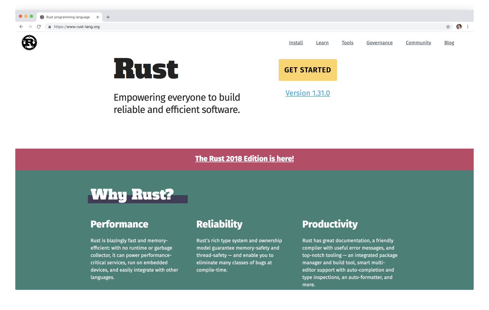
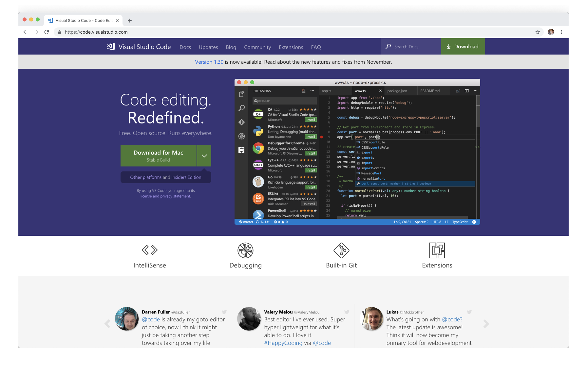

# Setup

## Install Node and Rust

I use Mac OS X 10.14 to write my examples. You probably have Node installed already, but just so we are on the same page we'll do it again together. You can install a single Node version like I describe now or install a tool to manage multiple Node versions as I describe in the next section and which is my recommended way.

The installation process is really simple. Just visit Nodes official site [nodejs.org](https://nodejs.org/en/) and download the installer for Node. At the time of writing the latest version with _long time support_ (short: _LTS_) is [v10.14.2](https://nodejs.org/dist/v10.14.2/node-v10.14.2.pkg) and the most _current_ version is [v11.4.0](https://nodejs.org/dist/v11.4.0/node-v11.4.0.pkg). I'll use v10.14.2, because the LTS release is often the lowest common denominator used by most library authors. A minor release happens about every _two weeks_ and you can find the release notes [in the Node blog](https://nodejs.org/en/blog/).


If you write `node --version` in your terminal you should see `v10.14.2` in your window:

```bash
$ node --version
v10.14.2
```

Rust's installation process is a little bit different. If you visit Rust's official site on [rust-lang.org](https://www.rust-lang.org/) and click on the _Install_ link in the header you'll not immediately see a link to install Rust, but to install a tool called `rustup`. While it is still possible to _just_ install Rust via an installer just as we did for Node, it is no longer the recommended way. So we go straight to the next section.

Just as a small addition: At the time of writing the latest stable Rust version is 1.31.0. A minor release happens about every _six weeks_ and you can find the release notes [in the Rust blog](https://blog.rust-lang.org/). Currently there are no LTS releases like they can be seen in the Node world, because every minor release was backwards compatible as no major release has happened after 1.0 so far.



## Manage multiple versions of Node and Rust

If you use Node or Rust for more serious work chances are pretty high that you want to upgrade easily to new versions or switch back to an old version, if you open an old project. You can do this for Node with a tool called [`nvm`](https://github.com/creationix/nvm) and for Rust with the already mentioned [`rustup`](https://github.com/rust-lang-nursery/rustup.rs). While `rustup` is the officially recommended way to manage Rust, `nvm` is a community project.

The installation process for both tools is very easy. To download and install `nvm` you just write this in your terminal:

```bash
$ curl -o- https://raw.githubusercontent.com/creationix/nvm/v0.33.11/install.sh | bash
```

After that you need to close and reopen your terminal. Check if the installation was successful with `nvm --version`:

```bash
$ nvm --version
0.33.11
```

You can install a specific Node version with `nvm install` and passing a version like `v10.14.2`:

```bash
$ nvm install v10.14.2
```

This will install `v10.14.2` and switch this version. You can manually switch between versions with `npm use` like this:

```bash
$ nvm use v4.4.5
Now using node v4.4.5 (npm v2.15.5)
```

If you want to set a default version which will be used everytime you fire up your terminal you can run `nvm alias default` and pass a version:

```bash
$ nvm alias default v4.4.5
default -> v4.4.5
```

To download and install `rustup` you just write this in your terminal:

```bash
$ curl https://sh.rustup.rs -sSf | sh
```

You'll be prompted with three options after `rustup` was installed:

```bash
1) Proceed with installation (default)
2) Customize installation
3) Cancel installation
```

Just choose `1` to install Rust.

```bash
  stable installed - rustc 1.31.0 (abe02cefd 2018-12-04)


Rust is installed now. Great!

To get started you need Cargo's bin directory ($HOME/.cargo/bin) in your PATH
environment variable. Next time you log in this will be done automatically.

To configure your current shell run source $HOME/.cargo/env
```

`rustc` was installed now - that is the Rust compiler.

You can verify if Rustup was installed correctly and which version you have that way:

```bash
$ rustup --version
rustup 1.16.0 (beab5ac2b 2018-12-06)
```

Now you can install a specific Rust version with `rustup install` and passing a version like `1.29.0`:

```bash
$ rustup install 1.29.0
info: syncing channel updates for '1.29.0-x86_64-apple-darwin'
info: latest update on 2018-09-13, rust version 1.29.0 (aa3ca1994 2018-09-11)
info: downloading component 'rustc'
 57.7 MiB /  57.7 MiB (100 %)   2.1 MiB/s ETA:   0 s
info: downloading component 'rust-std'
 45.8 MiB /  45.8 MiB (100 %)   2.4 MiB/s ETA:   0 s
info: downloading component 'cargo'
  3.3 MiB /   3.3 MiB (100 %)   2.3 MiB/s ETA:   0 s
info: downloading component 'rust-docs'
  8.2 MiB /   8.2 MiB (100 %)   3.6 MiB/s ETA:   0 s
info: installing component 'rustc'
info: installing component 'rust-std'
info: installing component 'cargo'
info: installing component 'rust-docs'

  1.29.0-x86_64-apple-darwin installed - rustc 1.29.0 (aa3ca1994 2018-09-11)
```

This installed version `1.29.0`. If you want to choose a default version, run this:

```bash
$ rustup default 1.29.0
info: using existing install for '1.29.0-x86_64-apple-darwin'
info: default toolchain set to '1.29.0-x86_64-apple-darwin'

  1.29.0-x86_64-apple-darwin unchanged - rustc 1.29.0 (aa3ca1994 2018-09-11)
```

After we feel comfortable in switching Node and Rust versions with `nvm` and `rustup` we'll now switch to the following version and verify that we'll use the same versions across the whole tutorial:

```bash
$ nvm alias default v10.14.2
default -> v10.14.2
$ node --version
v10.14.2

$ rustup default 1.31.0
  1.31.0-x86_64-apple-darwin installed - rustc 1.31.0 (abe02cefd 2018-12-04)
$ rustc --version
rustc 1.31.0 (abe02cefd 2018-12-04)
```

## Setup VS Code as your IDE

The IDE of my choice for Node and Rust projects is [VS Code](https://code.visualstudio.com/). It has awesome Typescript support as both projects are developed by Microsoft and their teams work closely together. But it also has awesome Rust support, as the _language server_ of Rust has an official reference implementation as a VS Code extension. (In case you're not familiar with the term _language server_: This is the piece of software which powers a lot of your typical IDE features like _code completion_ or _go to definition_.)

First install VS Code, if you haven't already. Just visit [code.visualstudio.com](https://code.visualstudio.com/) and download the installer. The _Download_ button is in the upper right corner.



On the following site you can choose between stable and insider releases. The insider releases offer new experimental features. I'll use the stable release which is version 1.30.0 at the time of writing.

If you open this project with VS Code you should see a small notification which asks to install all _recommended extensions_. This is a nice feature from VS Code which can be configured inside `.vscode/extensions.json`. Nevertheless - if you don't see the notification these are the extensions we want to install:

We need to install [Rust (rls)](https://marketplace.visualstudio.com/items?itemName=rust-lang.rust) - the Rust extension for VS Code. Just open VS Code, press `⌘P` (Quick Open) and type `ext install ext install rust-lang.rust`. Press enter and reload VS Code. The extension should now be installed. As soon as you open an `.rs` file (the file extension used for Rust code) the Rust extension will ask you to install the corresponding language service, if you haven't installed it already. Just accept it and everything should work fine.

One caveat: In order to fully work you need to have a `Cargo.toml` file in the root of your project. I'll explain what a `Cargo.toml` is in the chapter [_"Package Manager"_](../package-manager/README.md), but for now you can think of it like a `package.json` for Rust packages and that [Cargo](https://crates.io/) is used to manage dependencies in your Rust project, just like [npm](https://www.npmjs.com/) in Node projects. (We can workaround this by using a feature called [_workspaces_](https://doc.rust-lang.org/book/ch14-03-cargo-workspaces.html), which is really similar to [yarn workspaces](https://yarnpkg.com/lang/en/docs/workspaces/), if you ever used [yarn](https://yarnpkg.com/en/) instead of npm to manage dependencies in a Node project, but it _shouldn't_ be necessary, in my opinion. [I raised this as a feature request for Rust's language service.](https://github.com/rust-lang/rls/issues/1198))

But this brings us to the next VS Code extension we need: [Better TOML](https://marketplace.visualstudio.com/items?itemName=bungcip.better-toml), which supports syntax highlighting for `.toml` files. Open VS Code, press `⌘P` (Quick Open), type `ext install bungcip.better-toml` and press enter.

The Rust extension we installed earlier automatically supports formatting Rust files (by using a tool called [`rustfmt`](https://github.com/rust-lang/rustfmt)). Let's add the same functionality to our JavaScript and TypeScript files by installing an extension for the popular [_prettier_](https://prettier.io/). Open VS Code, press `⌘P` (Quick Open), type `ext install esbenp.prettier-vscode` and press enter.

I like to format all my files _on every save_ (and I like to slighlty adjust the default prettier config), so I put a [`.vscode/settings.json`](.vscode/settings.json) in the root of our project. This file is automatically picked up by VS Code, so you use the same config as I do by default.

We could add even more tooling support now, for example to support linters. (In the Rust ecosystem exists a popular linter called [Clippy](https://github.com/rust-lang/rust-clippy) which has the same purpose as [ESLint](https://eslint.org/) in the Node world.) But I think we're ready to go now and finally write some code! 🎉

---

[next _"Hello World"_](../hello-world/README.md) →
